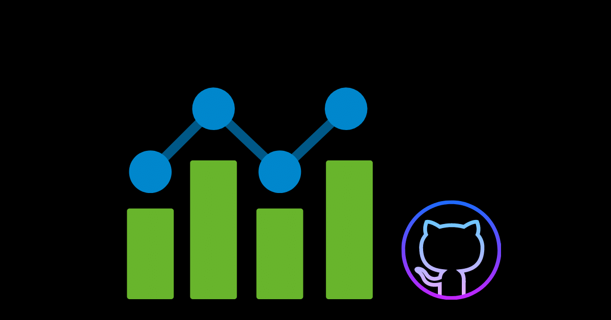

 
 <h2 align="center" style="color:#ffc107; font-size: 35px;">GitHub Stats</h2>
 
Get the details of the developers at your fingertips

    <a style="font-size:25px;" href="https://githubstats.xyz">Live Demo</a>

# Features

## Share
Share your profile to any one with your name, photo and details

`https://githubstats.xyz/user/username`
Replace the `username` with your github username

## Bookmark

Bookmark other users repos for later reference

# Future Plans
- [ ] Add a chart for the contributions of the user

# Support

You can support me [here](https://rahulmanoj.xyz/support)
